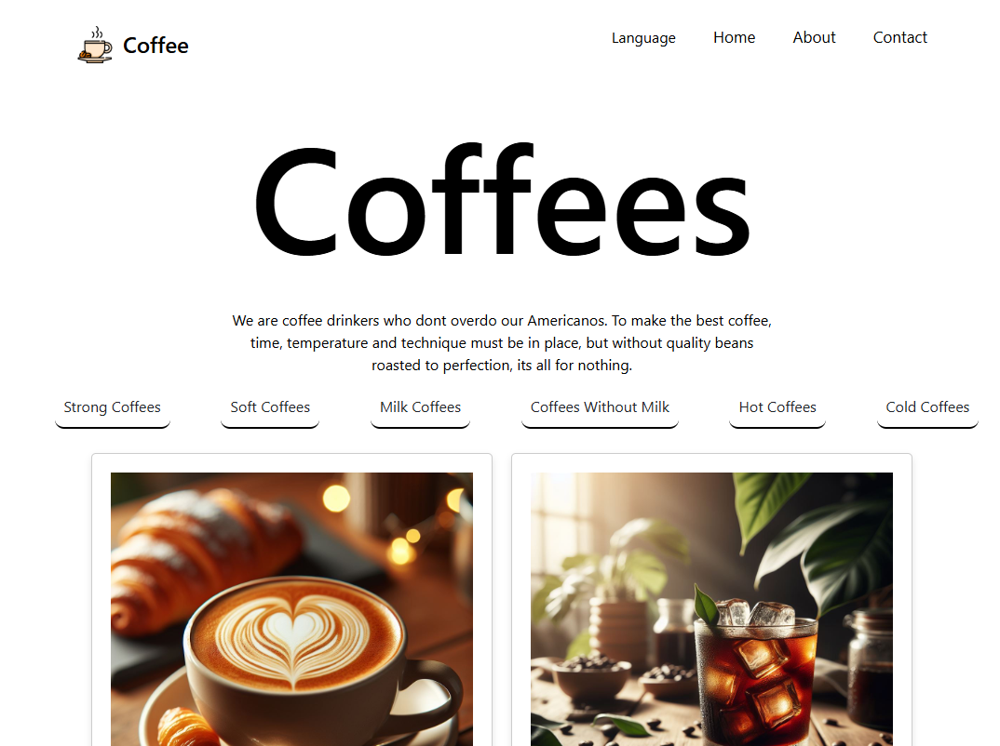
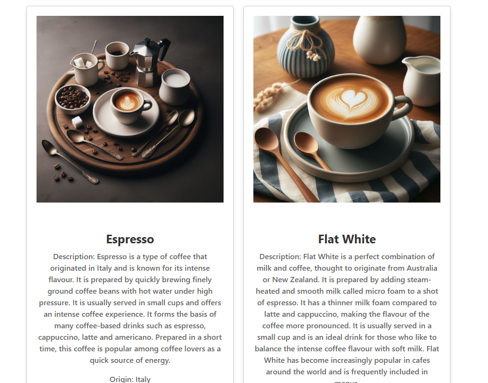
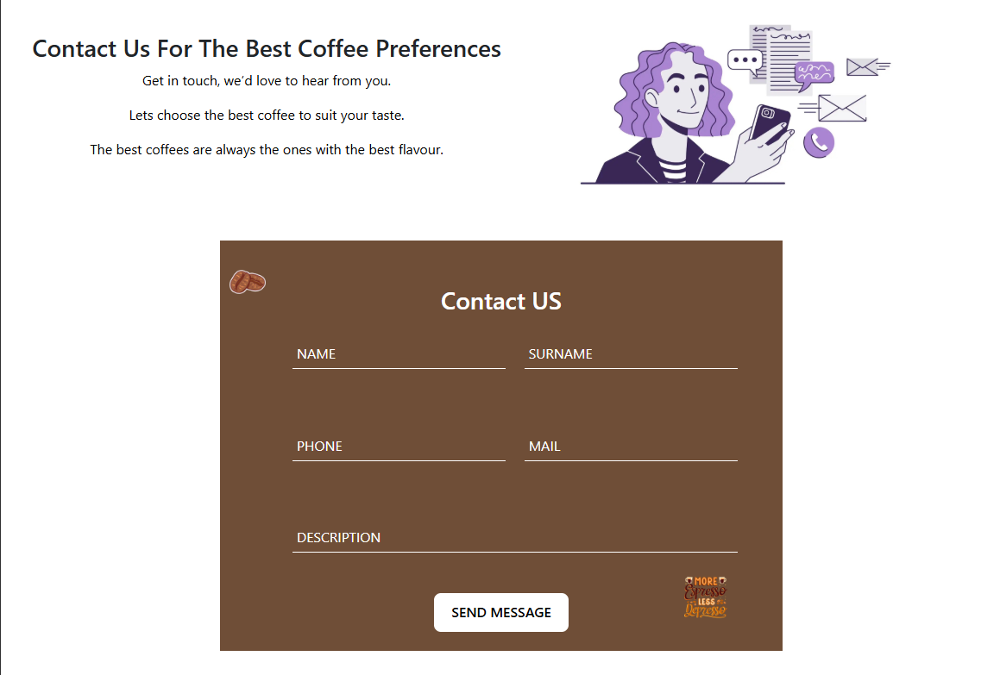

## **CoffeeFront** 🚀
Bu proje en güzel kahveleri ve kahve çeşitlerinin tarihçelerini gösteren bir React projesidir.
## **Özellikler** ✨

-   Özellik 1: Kahve verileri güncel bir şekilde gelmektedir.
-   Özellik 2: Hızlı ve güvenli bir altyapıya sahiptir.
-   Özellik 3: Front-End yapısı ağırlıklı bir web sitesidir.
-   Özellik 4: Resimler AI tarafından oluşturulmuş dur.
-   Özellik 5: Kahve verileri gerçek tarihçilere göre oluşturulmuştur.
## **Kurulum** ⚙️

Projeyi yerel makinenize kurmak için aşağıdaki adımları takip edin:
-   **Depoyu klonlayın:**
     `git clone https://github.com/durmaztayfun22/CoffeeFront.git` 
    
-   **Gerekli bağımlılıkları yükleyin:**
    `npm install` 
    
-   **Projenizi başlatın:**
    `node App.jsx`
   ## **Kullanım** 📚

Bu proje, kullanıcıların kahve türleri hakkında bilgi alabileceği, favori kahvelerini seçebileceği ve sipariş verebileceği bir kahve web sitesi sunar. Front-end kısmı, kullanıcı etkileşimlerini yönetmek ve veriyi dinamik olarak sunmak için modern web teknolojileriyle tasarlanmıştır. İşte bu sürecin nasıl çalıştığına dair detaylı bir açıklama:

### **Adım 1: Projeyi Başlatın**

Sunucuyu yerel makinenizde başlatmak için aşağıdaki komutları kullanabilirsiniz:
-   **Depoyu klonlayın:**
     `git clone https://github.com/durmaztayfun22/CoffeeFront.git` 
    
-   **Gerekli bağımlılıkları yükleyin:**
    `npm install` 
    
-   **Projenizi başlatın:**
    `node App.jsx`
  ### **Adım 2: Web Sitesini Görüntüleyin**

Dilediğiniz kahve çeşitlerini bulabilir, arayabilir ve seçebilirsiniz. Örnek bir resim:

